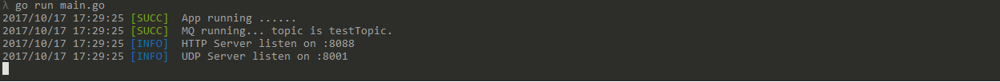
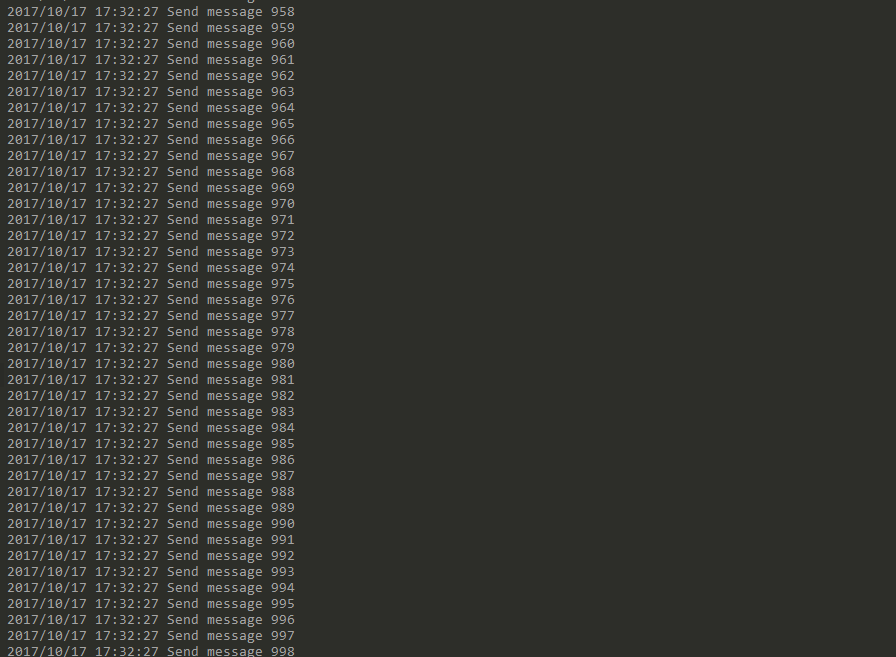
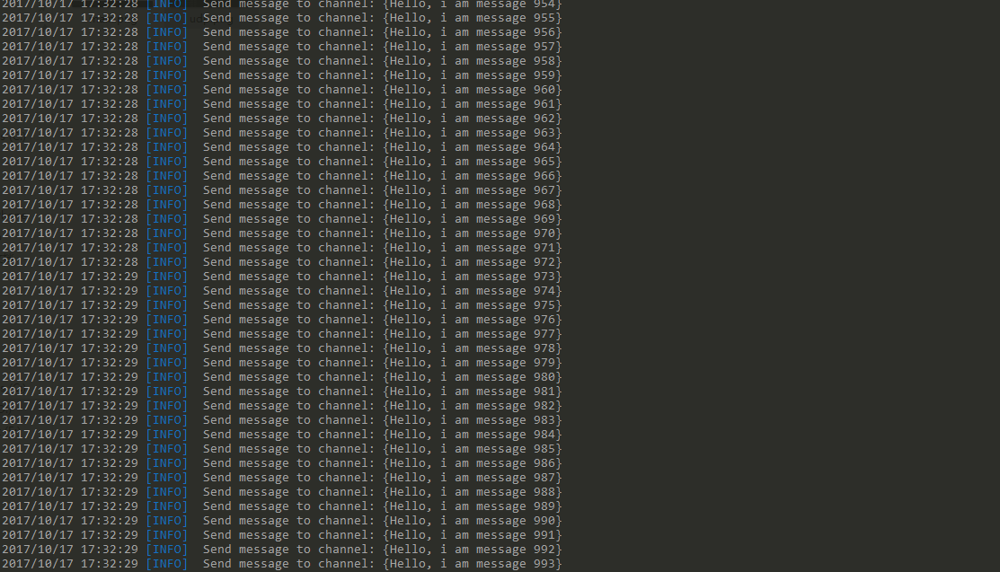
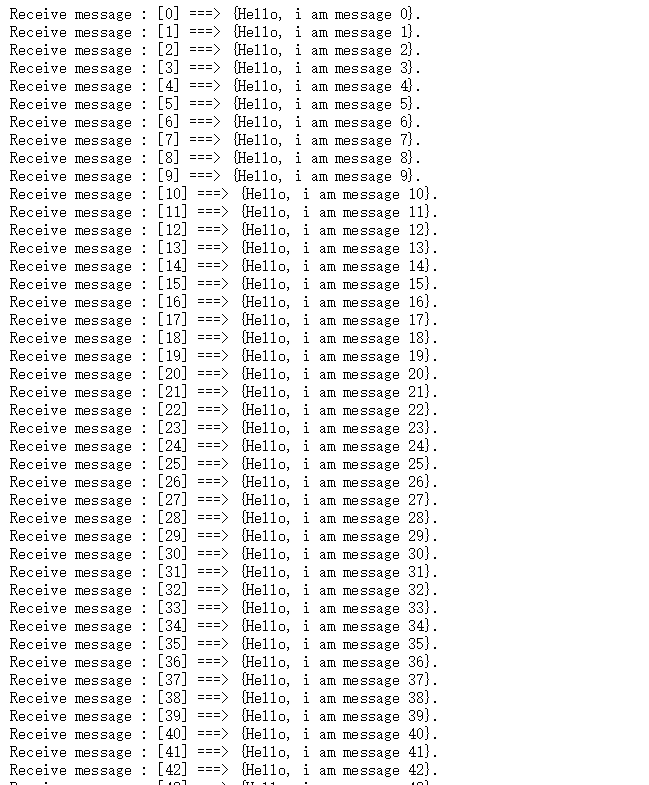

# Gomq

### A simple messageQueue with golang by channel.

### Usage:

* send message: (with udp) `nc -u localhsot 8001` push one message format with json
* receive messgae: read from http ---> `localhost:8080/topicName`

### Example

1. `go run main.go` 

2. `cd Examples && go run udpProducer.go`

3. `Open web browser http://localhost:8088/testTopic`

