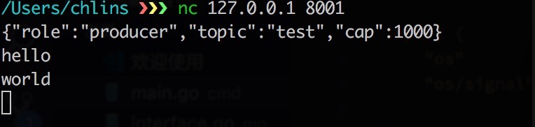
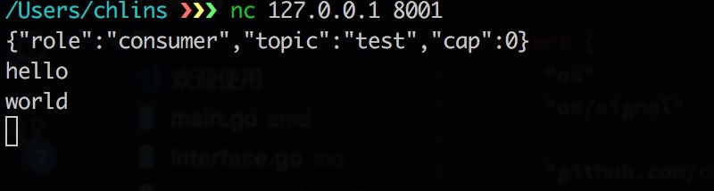

### Simple message queue 

[](https://travis-ci.org/chlins/Gomq)

#### Features 
* Simple and easy using.
* Provide message mode pub/sub via topic.
* Producer can set the cap of one of topic's message queue.

#### Usage:
`go run cmd/main.go` or if you don't have go dev env, you can run the binary file.

regInfo:
```
{
  "role"  // producer/consumer
  "topic" // set topic name 
  "cap"   // consumer set 0
}
```
cases: 

  producer:

    nc 127.0.0.1 8001 and send Reg info {"role":"producer","topic":"test","cap":1000}

  consumer:

    nc 127.0.0.1 8001 and send Reg info {"role":"consumer","topic":"test","cap":0}


